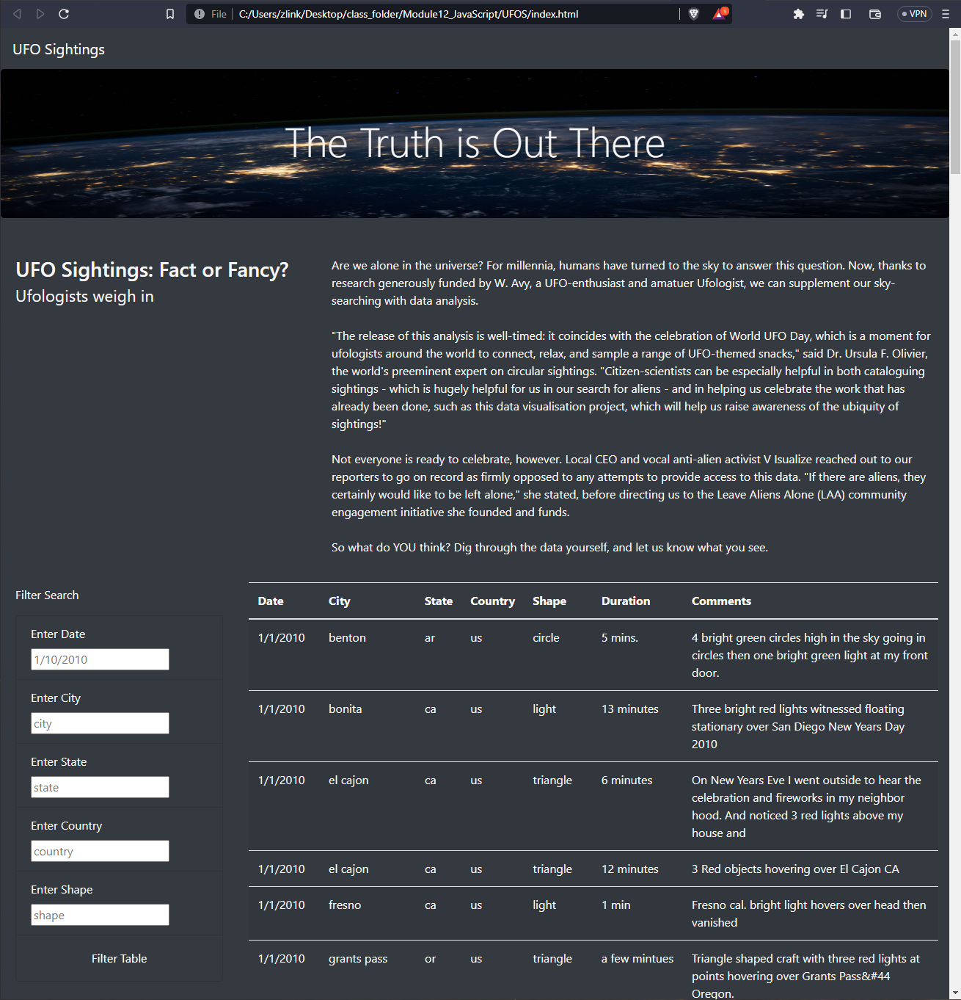
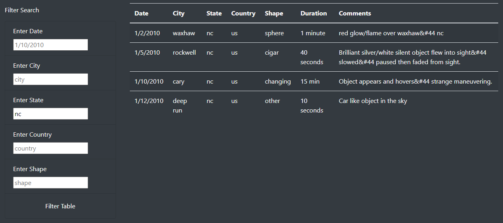
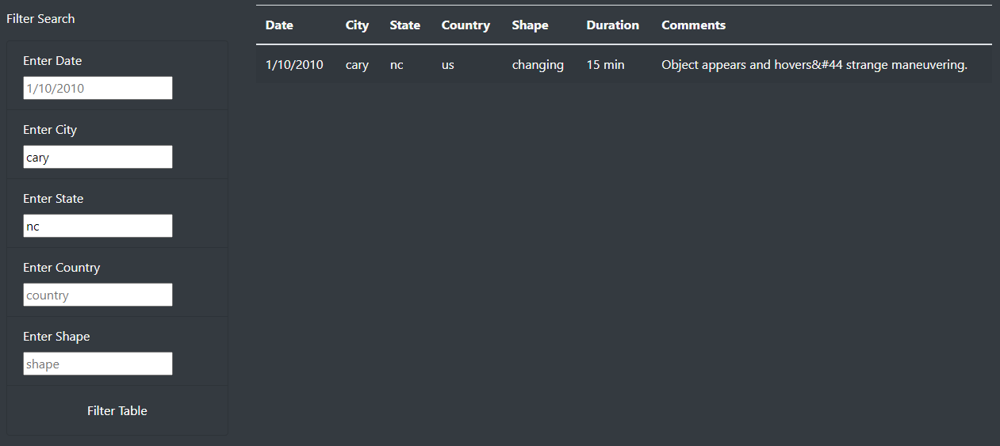

# UFOs

# Overview of Project

The purpose of this project was to create a dynamic, user-friendly webpage that allows users to filter UFO sighting data based on multiple search criteria. The webpage includes a table populated with UFO sighting data that can be filtered by date, city, state, country, and shape of the sighting.

## Results

To use the new webpage, users can enter their desired filter criteria into the filter search box on the left-hand side of the webpage.

For example, if a user wanted to view all UFO sightings in the state of North Carolina (NC), they would simply type "nc" into the "Enter State" input field. The table would then automatically update to include only entries where the state is "nc".

The filtered table would look something like this:

The webpage allows for multiple filters to be applied at once. For example, if a user wanted to find sightings in the city of Cary within the state of North Carolina, they would enter "nc" in the "Enter State" input field and "Cary" in the "Enter City" input field. The table would then update to show only entries that meet both criteria.

## Summary

While the current design of the webpage is highly functional and easy to use, there are a few areas where improvements could be made. One drawback of the current design is that users must know the exact term they want to filter by. For instance, if a user doesn't know the exact spelling of a city, they might have difficulty using the city filter.

To address this, one recommendation for further development would be to implement a type-ahead or autocomplete feature on the filter inputs, which would suggest possible filter terms as users begin typing. This would make the filter functionality more accessible and easier to use.

Another recommendation would be to implement a way to sort table columns in ascending or descending order. This would be particularly useful for the date column, as users might be interested in viewing the most recent sightings.

Lastly, adding a way to specify the number of entries to view at a time could help improve the user experience for cases when there are a large number of sightings matching the filter criteria. Currently, if the table becomes too long, users would need to scroll a lot which can be cumbersome and hinder usability.
